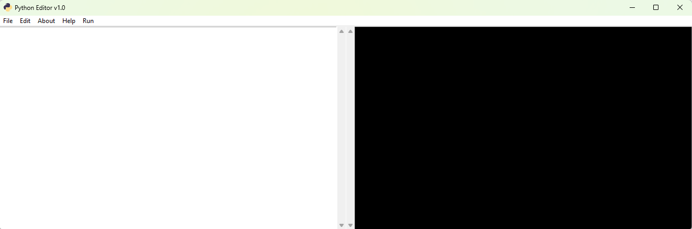
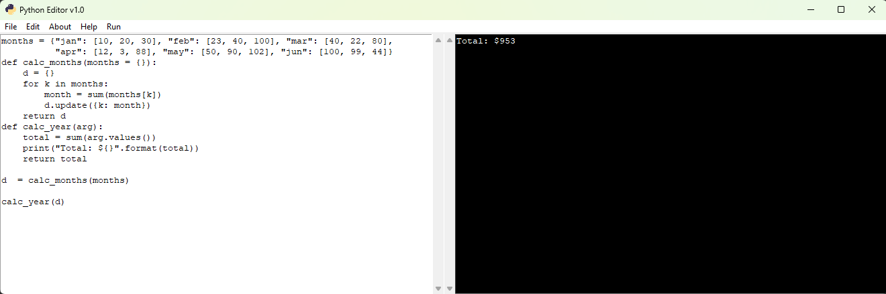

# Python Editor v1.0

## Overview
This project is a simple Python code editor built using Tkinter. The editor allows users to write, edit, save, and execute Python scripts within the GUI. It also provides options for text editing, searching, and viewing terminal output.

## Features
- **Open Python Files**: Load `.py` files into the editor.
- **Save Python Files**: Save the content of the editor as `.py` files.
- **Run Code**: Execute Python scripts directly from the editor and view output or errors in a built-in terminal.
- **Edit Tools**: Cut, copy, paste, find, replace, and clear text.
- **Customizable Interface**: Includes scrollbars for the code editor and terminal for easy navigation.
- **Help and About Sections**: Informative pop-ups for assistance and project information.

## Requirements
- Python 3.x
- Tkinter (comes pre-installed with most Python installations)
- `subprocess` module (standard Python library)

## How to Use
1. Clone or download this repository.
2. Ensure Python 3 is installed on your system.
3. Run the script:
   ```bash
   python gui.py
   ```
4. Use the menus to:
   - **File**: Open, save, or exit.
   - **Edit**: Modify text or search and replace.
   - **Run**: Execute your Python code and view the output in the terminal section.
   - **Help/About**: Access information about the editor.

## Functionalities
### File Operations
- **Open**: Opens a file dialog to select a `.py` file and loads its content into the editor.
- **Save**: Saves the current content of the editor to a specified location.

### Edit Tools
- **Cut/Copy/Paste**: Standard text editing operations.
- **Find**: Highlights the first occurrence of the specified text.
- **Replace**: Replaces all occurrences of a specific text with another text.
- **Clear**: Deletes all text in the editor.

### Code Execution
- **Run Code**: Executes the current code in the editor and displays the output or errors in the terminal section.
- **Clear Terminal**: Clears the terminal output area.

## GUI Components
1. **Code Editor**: A text area for writing and editing Python code, with a vertical scrollbar.
2. **Terminal**: A text area that displays output or errors from the executed Python scripts, with a vertical scrollbar.
3. **Menu Bar**: Includes dropdown menus for File, Edit, About, Help, and Run operations.

## Screenshots
### Main Interface


### Code Execution


## File Structure
- `gui.py`: The main script containing the Tkinter GUI and functionality.
- `python_icon.ico`: (Optional) Icon for the application window.
- `.temp_file.py`: Temporary file used for executing code.
- `IMAGES/`: Folder containing screenshots used in the README.

## Notes
- Ensure that you have permission to execute Python files on your system.
- The editor temporarily saves the code to `.temp_file.py` for execution.
